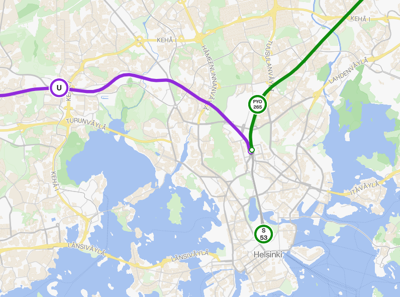

# Hekinav v3

The third generation of the HekiNav routing UI. This version has a new look, more configurability and less bugs. Built with Cloudflare vinext.

View the production version at [routing.hekinav.dev](https://routing.hekinav.dev/)


## Quick links
- [Features](#features)
- [Images](#images)
- [Usage](#usage)

## Features

### Two routing engines

Hekinav routing utilises multiple routing engines for optimal results. Both have their pros and cons.

1. Hekinav
- Uses [MOTIS](https://github.com/motis-project/motis)
- Faster than Digitransit
- Better walking paths
- 

2. Digitransit
- Uses [OpenTripPlanner](https://www.opentripplanner.org/)
- More configuration options
- Better realtime data integration
- Via points

### Settings

Hekinav Routing has a highly configurable global config system that makes it easy to add new options to the config and settings ui elements linked to them. This config system can be used in other projects as its easily adaptable to other config objects.


The config context available in all page components includes the config object and strictly typed getter and setter which use an array of paths to get/set the correct value. 

```typescript
setConfigPath(value: boolean, ["path","to","boolean"], ["other", "path", "to", "boolean"])
```

### Mobile compatibility

The website is compatible with most desktop and mobile devices. Safari sometimes has issues with opening the keyboard.

When on mobile:
- The sidebar turns into a drawer
- The logo in the navbar becomes smaller to fit on smaller screens


Below is an example


### Two modes

The routing has two different modes: HSL and Finland. 

**Feature comparison**
| Feature                                        | HSL             | Finland                  |
|------------------------------------------------|-----------------|--------------------------|
| Region                                         | Helsinki Region | All of Finland & Estonia |
| Real-time position                             | Yes             | Mostly works             |
| A more consistent and polished user experience | Yes             | No                       |

The reason for these differences is that as a single coordinated organization, HSL's data has a standardized fromat, unlike the combined Finland dataset. For any trips in the HSL region, it is recommended to use the HSL mode. HSL also produces good quality real-time vehicle position data.

## Images





## Usage

When running, it is recommended to update /public/map_style.json and /public/map_style_hsl.json to use your own API keys for tiles and your own object storage for sprites. My keys will not work on sites other than mine.


The following examples use vinext, but all npm commands exist for the normal Next.js. To use them, remove the `:vinext` suffix from commands. You should kepp in mind that the environment variables have been configured for wrangler with `.dev.vars` which will not work with base Next.js or Vercel

### Memory requirements and performance

The vinext dev server uses quite a lot of system resources especially when this project has a very heavy dependecy list (vinext, tailwind, maplibre, workerd).

#### Memory specs

- Minimum: 8gb (runs a browser (~1-2Gb) and the dev server (~4-5Gb))
- Recommended: 12+ gb (for running VSCode with type-checking)

Some things, like server functions (for example search boxes and geolocation) take a while to initialize in the dev environment after starting or after a server side reload. After theyre initialized, they should be fast, but the first query usually takes 10 seconds.

### Development

Production is handled with Vite runtime on the local device.

1. Create a `.dev.vars` file based on `.dev.vars.template` (Instructions in file)

2. Install dependencies: `npm install`

3. Start dev server: `npm run dev:vinext`

4. Open [http://localhost:3001](http://localhost:3001)

### Production

Production is handled with the cloudflare Wrangler runtime, either on the local machine or on Cloudflare workers. This may handle some things like cryptography differently that the Vite dev runtime.

1. Update secrets (if changed):

For each secret in .dev.vars: `npx wrangler secret put <SECRET_NAME>`, then paste the value

2. Install dependencies (if not installed already): `npm install`

3. Build: `npm run build:vinext`

4. Preview: `npm run start:vinext`

5. Open preview [http://localhost:8787](http://localhost:8787)

6. Deploy to Cloudflare Workers: `npm run deploy:vinext`