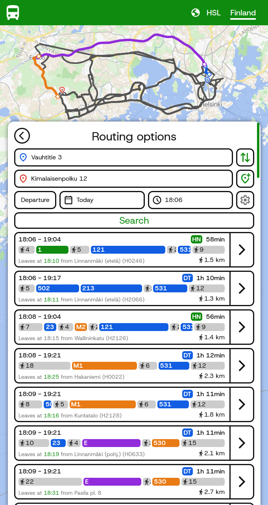
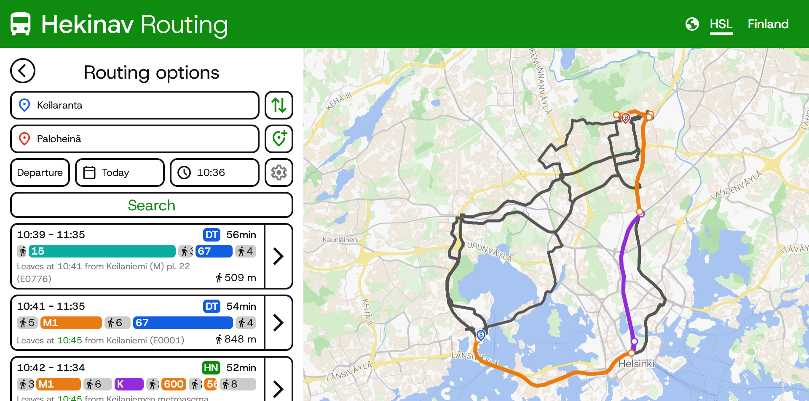
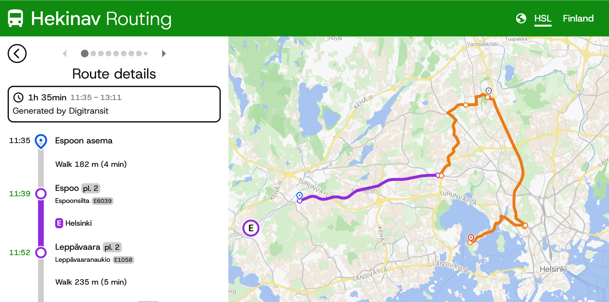
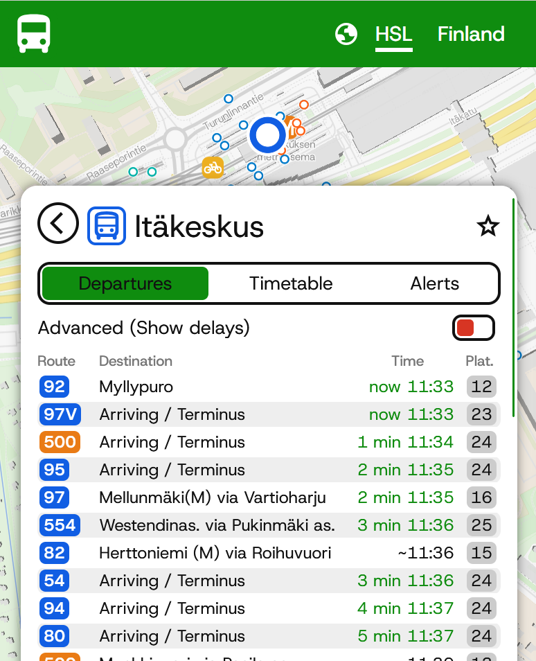

# Hekinav v3

The third generation of the HekiNav routing UI. This version has a new look, more configurability and less bugs. Built with Cloudflare vinext.

View the production version at [routing.hekinav.dev](https://routing.hekinav.dev/)

## Quick links
- [Features](#features)
- [Images](#images)
- [Usage](#usage)

## Features

### Two routing engines

Hekinav routing utilises multiple routing engines for optimal results

**Routing engines**
1. Hekinav
- Uses MOTIS
- Faster than Digitransit

2. Digitransit
- Uses OpenTripPlanner 
- More configuration options
- Better realtime data integration

### Settings

Hekinav Routing has a highly configurable global config system that makes it easy to add new options to the config and settings ui elements linked to them. 

### Mobile compatibility

The website is compatible with most desktop and mobile devices. Safari sometimes has issues with opening the keyboard.

When on mobile:
- The sidebar turns into a drawer
- The logo in the navbar becomes smaller to fit on smaller screens

### Two modes

The routing has two different modes: HSL and Finland. 

**Feature comparison**
| Feature                                        | HSL             | Finland                  |
|------------------------------------------------|-----------------|--------------------------|
| Region                                         | Helsinki Region | All of Finland & Estonia |
| Real-time position                             | ✅              | ❌                       |
| A more consistent and polished user experience | ✅              | ❌                       |

The reason for these differences is that as a single coordinated organization, HSL's data has a standardized fromat, unlike the combined Finland dataset. For any trips in the HSL region, it is recommended to use the HSL mode. HSL also produces good quality real-time vehicle position data.

## Images

## Usage

When running, it is recommended to update /public/map_style.json and /public/map_style_hsl.json to use your own API keys for tiles and your own object storage for sprites. My keys will not work on sites other than mine.

### Development

1. Create a `.dev.vars` file based on `.dev.vars.template` (Instructions in file)

2. Install dependencies: `npm install`

3. Start dev server: `npm run dev:vinext`

4. Open http://localhost:3001

### Production

1. Update secrets (if changed):

For each secret in .dev.vars: `npx wrangler secret put <SECRET_NAME>`, then paste the value

2. Build: `npm run build:vinext`

3. Preview: `npm run start:vinext`

4. Deploy to Cloudflare Workers: `npm run deploy:vinext`